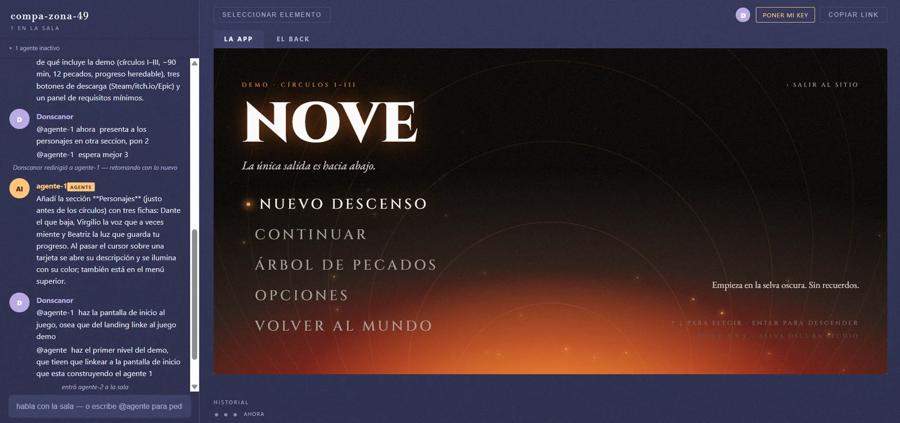

# Multi

A live room where you, your friends and several agents build the same app. Open source.



Someone asks in plain language, the agent answers in terms of what changed, and the app on the right updates without a refresh. Everyone in the room sees it at the same time.

[](LICENSE)


## Install

```bash
git clone https://github.com/ErickUser1/multi
cd multi
npm install
npm start
```

Open **http://localhost:4000**, create a room, ask an agent for something. It'll ask for your API key, and that's the whole setup.

Needs [Node 22+](https://nodejs.org). [Docker](https://docs.docker.com/get-started/get-docker/) is optional but recommended: with it, each room runs isolated in its own container. Without it, agents run commands directly on your machine and the server says so on startup.

### Bring someone in

```bash
npm run compartir
```

Prints a public link. Send it and they walk in. nothing to install on their side.

> While that runs your machine is on the internet, and anyone with the link can enter any room. `Ctrl+C` when you're done.

## Why

Every work tool of the last two decades won by going multiplayer. Google Docs beat Word. Figma beat Photoshop.

AI coding hasn't had that moment. You open a chat, type a prompt, get an answer in a box only you can see. Two people building the same thing means two private threads, two agents, and finding out you diverged three days later.

Multi makes the project the place you're in, not the file you pass around.

<sub>The idea comes from <a href="https://www.ycombinator.com/rfs">Multiplayer AI</a> (Aaron Epstein, YC RFS).</sub>

## How it feels

- **`@agente` to talk to an agent.** Without the mention, the chat is just people, you can think out loud without anyone starting to work.
- **Anyone can interrupt any agent.** Your teammate asked for a red header, you see it going wrong: `@agente-1 make it blue` stops it right there.
- **Several agents at once.** They work in parallel; the engine keeps them from stepping on each other.
- **Point and talk.** Click an element in the preview, everyone sees your selection, and what you ask applies to it.
- **The history belongs to the room.** Every agent turn is a point you can go back to.

## Your model, your account

Everyone brings their own key and pays only for what they ask. In one room, one person can be on Claude, another on a free model, another on a local one.

Anthropic · OpenRouter · OpenAI · Groq · DeepSeek · Ollama

Your key lives in your browser and in the server's memory while you're connected, never on disk, never inside the container, never visible to anyone else in the room.

## Under the hood

Each room is a folder with its own git, isolated in its own container. The agent is hand-written, with no agent framework and no model SDK. Rooms start empty: it scaffolds whatever stack you ask for.

Full walkthrough in **[E2E.md](E2E.md)** · What's missing and why in **[ROADMAP.md](ROADMAP.md)** · Both in Spanish.

## Language

The UI, code, comments and commits are in Spanish. This README is in English so the project can be found, but if you open `keyed-mutex.ts` you'll read *"misma clave hace fila."*

Deliberate, not an oversight. PRs in either language. just keep the file you touch consistent with itself.

## Contributing

See [CONTRIBUTING.md](CONTRIBUTING.md). MIT licensed.
